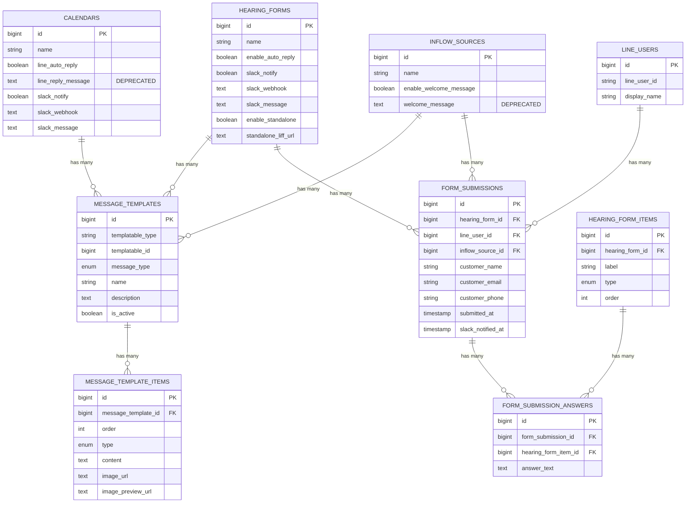

# データベース設計詳細

## ER図



## テーブル詳細

### message_templates

**役割**: 各コンテキストで使用するメッセージテンプレートの管理

| カラム名 | 型 | NULL | デフォルト | 説明 |
|---------|---|------|-----------|------|
| id | BIGINT UNSIGNED | NO | AUTO_INCREMENT | 主キー |
| templatable_type | VARCHAR(255) | NO | - | ポリモーフィック型 |
| templatable_id | BIGINT UNSIGNED | NO | - | ポリモーフィックID |
| message_type | ENUM | NO | - | メッセージ種別 |
| name | VARCHAR(255) | NO | - | テンプレート名 |
| description | TEXT | YES | NULL | 説明 |
| is_active | BOOLEAN | NO | TRUE | 有効/無効 |
| created_at | TIMESTAMP | YES | NULL | 作成日時 |
| updated_at | TIMESTAMP | YES | NULL | 更新日時 |

**message_type 値**:
- `reservation_created`: 予約完了時
- `reservation_confirmed`: 予約確定時
- `reservation_cancelled`: 予約キャンセル時
- `reminder`: リマインド時
- `welcome`: ウェルカムメッセージ
- `form_submitted`: フォーム送信完了時

**templatable_type 値**:
- `App\Models\Calendar`
- `App\Models\InflowSource`
- `App\Models\HearingForm`

**インデックス**:
```sql
INDEX idx_templatable (templatable_type, templatable_id)
INDEX idx_message_type (message_type)
INDEX idx_active (is_active)
```

### message_template_items

**役割**: テンプレート内の個別メッセージ要素（テキスト/画像）

| カラム名 | 型 | NULL | デフォルト | 説明 |
|---------|---|------|-----------|------|
| id | BIGINT UNSIGNED | NO | AUTO_INCREMENT | 主キー |
| message_template_id | BIGINT UNSIGNED | NO | - | テンプレートID |
| order | INT | NO | 1 | 表示順序 (1-5) |
| type | ENUM('text','image') | NO | - | メッセージタイプ |
| content | TEXT | YES | NULL | テキスト内容 |
| image_url | TEXT | YES | NULL | 画像URL |
| image_preview_url | TEXT | YES | NULL | プレビューURL |
| original_filename | VARCHAR(255) | YES | NULL | 元ファイル名 |
| file_size | INT | YES | NULL | ファイルサイズ(bytes) |
| mime_type | VARCHAR(100) | YES | NULL | MIMEタイプ |
| created_at | TIMESTAMP | YES | NULL | 作成日時 |
| updated_at | TIMESTAMP | YES | NULL | 更新日時 |

**制約**:
```sql
FOREIGN KEY (message_template_id) REFERENCES message_templates(id) ON DELETE CASCADE
CHECK (order >= 1 AND order <= 5)
```

**インデックス**:
```sql
INDEX idx_template_order (message_template_id, order)
```

**バリデーションルール**:
- `type = 'text'` の場合: `content` は必須
- `type = 'image'` の場合: `image_url`, `image_preview_url` は必須
- `order` は 1〜5 の範囲内

### form_submissions

**役割**: 独立したフォーム送信の記録

| カラム名 | 型 | NULL | デフォルト | 説明 |
|---------|---|------|-----------|------|
| id | BIGINT UNSIGNED | NO | AUTO_INCREMENT | 主キー |
| hearing_form_id | BIGINT UNSIGNED | NO | - | フォームID |
| line_user_id | BIGINT UNSIGNED | YES | NULL | LINEユーザーID |
| inflow_source_id | BIGINT UNSIGNED | YES | NULL | 流入経路ID |
| customer_name | VARCHAR(255) | YES | NULL | お客様名 |
| customer_email | VARCHAR(255) | YES | NULL | メールアドレス |
| customer_phone | VARCHAR(20) | YES | NULL | 電話番号 |
| ip_address | VARCHAR(45) | YES | NULL | IPアドレス |
| user_agent | TEXT | YES | NULL | ユーザーエージェント |
| slack_notified_at | TIMESTAMP | YES | NULL | Slack通知日時 |
| submitted_at | TIMESTAMP | NO | CURRENT_TIMESTAMP | 送信日時 |
| created_at | TIMESTAMP | YES | NULL | 作成日時 |
| updated_at | TIMESTAMP | YES | NULL | 更新日時 |

**制約**:
```sql
FOREIGN KEY (hearing_form_id) REFERENCES hearing_forms(id) ON DELETE CASCADE
FOREIGN KEY (line_user_id) REFERENCES line_users(id) ON DELETE SET NULL
FOREIGN KEY (inflow_source_id) REFERENCES inflow_sources(id) ON DELETE SET NULL
```

**インデックス**:
```sql
INDEX idx_form (hearing_form_id)
INDEX idx_line_user (line_user_id)
INDEX idx_submitted_at (submitted_at)
```

### form_submission_answers

**役割**: フォーム送信の各項目への回答

| カラム名 | 型 | NULL | デフォルト | 説明 |
|---------|---|------|-----------|------|
| id | BIGINT UNSIGNED | NO | AUTO_INCREMENT | 主キー |
| form_submission_id | BIGINT UNSIGNED | NO | - | フォーム送信ID |
| hearing_form_item_id | BIGINT UNSIGNED | NO | - | フォーム項目ID |
| answer_text | TEXT | YES | NULL | 回答内容 |
| created_at | TIMESTAMP | YES | NULL | 作成日時 |
| updated_at | TIMESTAMP | YES | NULL | 更新日時 |

**制約**:
```sql
FOREIGN KEY (form_submission_id) REFERENCES form_submissions(id) ON DELETE CASCADE
FOREIGN KEY (hearing_form_item_id) REFERENCES hearing_form_items(id) ON DELETE CASCADE
```

**インデックス**:
```sql
INDEX idx_submission (form_submission_id)
INDEX idx_item (hearing_form_item_id)
```

## マイグレーション順序

1. `create_message_templates_table.php`
2. `create_message_template_items_table.php`
3. `create_form_submissions_table.php`
4. `create_form_submission_answers_table.php`
5. `add_messaging_fields_to_hearing_forms_table.php`

## データマイグレーション計画

### 既存データの移行

#### Step 1: Calendar メッセージの移行
```sql
-- line_reply_message から message_templates への移行
INSERT INTO message_templates (templatable_type, templatable_id, message_type, name, is_active, created_at, updated_at)
SELECT 
    'App\\Models\\Calendar',
    id,
    'reservation_created',
    CONCAT(name, ' - 予約完了メッセージ'),
    line_auto_reply,
    NOW(),
    NOW()
FROM calendars
WHERE line_reply_message IS NOT NULL;

INSERT INTO message_template_items (message_template_id, order, type, content, created_at, updated_at)
SELECT 
    mt.id,
    1,
    'text',
    c.line_reply_message,
    NOW(),
    NOW()
FROM message_templates mt
JOIN calendars c ON c.id = mt.templatable_id
WHERE mt.templatable_type = 'App\\Models\\Calendar'
AND mt.message_type = 'reservation_created';
```

#### Step 2: InflowSource ウェルカムメッセージの移行
```sql
INSERT INTO message_templates (templatable_type, templatable_id, message_type, name, is_active, created_at, updated_at)
SELECT 
    'App\\Models\\InflowSource',
    id,
    'welcome',
    CONCAT(name, ' - ウェルカムメッセージ'),
    enable_welcome_message,
    NOW(),
    NOW()
FROM inflow_sources
WHERE welcome_message IS NOT NULL;

INSERT INTO message_template_items (message_template_id, order, type, content, created_at, updated_at)
SELECT 
    mt.id,
    1,
    'text',
    i.welcome_message,
    NOW(),
    NOW()
FROM message_templates mt
JOIN inflow_sources i ON i.id = mt.templatable_id
WHERE mt.templatable_type = 'App\\Models\\InflowSource'
AND mt.message_type = 'welcome';
```

### 後方互換性

移行期間中は以下の優先順位で処理：

1. `message_templates` が存在する場合 → テンプレートを使用
2. 従来の `line_reply_message` / `welcome_message` → レガシー処理

```php
// 例: Calendar の自動返信
if ($calendar->messageTemplates()->where('message_type', 'reservation_created')->exists()) {
    // 新システム
    $template = $calendar->messageTemplates()
        ->where('message_type', 'reservation_created')
        ->where('is_active', true)
        ->first();
    $this->lineMessagingService->sendTemplate($userId, $template, $data);
} else if ($calendar->line_reply_message) {
    // レガシーシステム
    $message = $this->replacePlaceholders($calendar->line_reply_message, $data);
    $this->lineMessagingService->sendMessage($userId, $message);
}
```

## ストレージ設計

### 画像保存パス構造

```
storage/
└── app/
    └── public/
        └── line_images/
            └── {tenant_id}/
                ├── originals/
                │   └── {timestamp}_{random}.jpg
                └── previews/
                    └── {timestamp}_{random}_preview.jpg
```

### 公開URL

```
https://yourdomain.com/storage/line_images/{tenant_id}/originals/{filename}
https://yourdomain.com/storage/line_images/{tenant_id}/previews/{filename}
```

### ファイル命名規則

```php
$timestamp = time();
$random = Str::random(8);
$extension = $file->getClientOriginalExtension();
$filename = "{$timestamp}_{$random}.{$extension}";
```

## パフォーマンス最適化

### インデックス戦略

1. **複合インデックス**
   - `(templatable_type, templatable_id, message_type, is_active)` for message_templates
   - `(message_template_id, order)` for message_template_items

2. **カバリングインデックス**
   - よく使うカラムをインデックスに含める

### クエリ最適化

```php
// Eager Loading
$calendar = Calendar::with([
    'messageTemplates' => function($query) {
        $query->where('message_type', 'reservation_created')
              ->where('is_active', true)
              ->with('items');
    }
])->find($id);

// キャッシュ活用
$template = Cache::remember(
    "calendar:{$calendarId}:template:reservation_created",
    3600,
    fn() => MessageTemplate::with('items')
        ->where('templatable_type', 'App\Models\Calendar')
        ->where('templatable_id', $calendarId)
        ->where('message_type', 'reservation_created')
        ->where('is_active', true)
        ->first()
);
```

## セキュリティ考慮事項

### 画像アップロード

1. **ファイル検証**
   - MIMEタイプチェック（image/jpeg, image/png のみ）
   - ファイルサイズ制限（最大10MB）
   - 画像の実体検証（getimagesize）

2. **ファイル名サニタイズ**
   - ユーザー入力ファイル名を直接使用しない
   - ランダム文字列を使用

3. **アクセス制御**
   - テナント分離
   - 認証済みユーザーのみアップロード可能

### SQL インジェクション対策

- Eloquent ORMの使用
- プリペアドステートメント
- バインドパラメータの使用

### XSS対策

- ユーザー入力のエスケープ
- `{!! !!}` の使用を避ける
- Content Security Policy の設定

---

**作成日**: 2025年10月30日  
**バージョン**: 1.0

