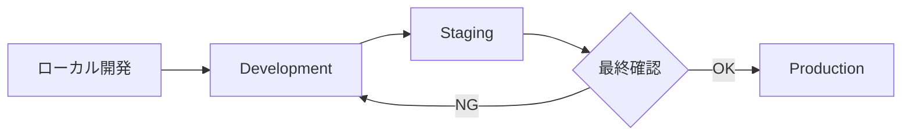

# 実装計画書

## プロジェクト概要

**プロジェクト名**: LINEメッセージ送信システム拡張  
**期間**: 約8週間（2ヶ月）  
**開始予定**: 2025年11月上旬  
**完了予定**: 2025年12月下旬

---

## チーム構成（推奨）

| 役割 | 人数 | 担当範囲 |
|-----|------|---------|
| バックエンド開発者 | 1-2名 | API、データベース、LINE/Slack連携 |
| フロントエンド開発者 | 1-2名 | React管理画面、LIFF画面 |
| QAエンジニア | 1名 | テスト計画、実施 |
| プロジェクトマネージャー | 1名 | 進行管理、調整 |

---

## Phase 1: データベース構築（Week 1）

### 目標
新規テーブルの作成と既存テーブルの更新

### タスク

#### 1.1 マイグレーションファイル作成
- [ ] `create_message_templates_table.php`
- [ ] `create_message_template_items_table.php`
- [ ] `create_form_submissions_table.php`
- [ ] `create_form_submission_answers_table.php`
- [ ] `add_messaging_fields_to_hearing_forms_table.php`

**見積もり時間**: 8時間

#### 1.2 モデル作成
- [ ] `MessageTemplate.php`
- [ ] `MessageTemplateItem.php`
- [ ] `FormSubmission.php`
- [ ] `FormSubmissionAnswer.php`

**見積もり時間**: 8時間

#### 1.3 リレーション定義
- [ ] ポリモーフィックリレーション（MessageTemplate）
- [ ] HasMany/BelongsToリレーション
- [ ] Eager Loading設定

**見積もり時間**: 4時間

#### 1.4 シーダー作成
- [ ] MessageTemplateSeeder（サンプルデータ）
- [ ] 開発環境用テストデータ

**見積もり時間**: 4時間

### 成果物
- ✅ マイグレーションファイル（5件）
- ✅ モデルファイル（4件）
- ✅ シーダーファイル（1件）

### 完了条件
- [ ] `php artisan migrate` が成功する
- [ ] `php artisan db:seed` が成功する
- [ ] リレーションが正しく動作する

---

## Phase 2: メッセージテンプレート機能（Week 2-3）

### 目標
テンプレート管理のバックエンドAPI実装

### Week 2: バックエンドAPI

#### 2.1 コントローラー作成
- [ ] `MessageTemplateController.php`
  - [ ] index（一覧取得）
  - [ ] show（詳細取得）
  - [ ] store（作成）
  - [ ] update（更新）
  - [ ] destroy（削除）
  - [ ] preview（プレビュー送信）

**見積もり時間**: 12時間

#### 2.2 リクエスト/リソース作成
- [ ] `StoreMessageTemplateRequest.php`
- [ ] `UpdateMessageTemplateRequest.php`
- [ ] `MessageTemplateResource.php`
- [ ] `MessageTemplateItemResource.php`

**見積もり時間**: 6時間

#### 2.3 サービスクラス作成
- [ ] `MessageTemplateService.php`
  - [ ] buildMessages（メッセージ構築）
  - [ ] replacePlaceholders（プレースホルダー置換）
  - [ ] validateTemplate（テンプレート検証）

**見積もり時間**: 8時間

#### 2.4 画像アップロード機能
- [ ] 画像アップロードエンドポイント
- [ ] 画像リサイズ処理
- [ ] プレビュー画像生成
- [ ] ストレージ管理

**見積もり時間**: 10時間

#### 2.5 LINE送信サービス拡張
- [ ] `LineMessagingService::sendTemplate()`
- [ ] `LineMessagingService::buildLineMessages()`
- [ ] 複数メッセージ送信対応

**見積もり時間**: 8時間

#### 2.6 ルート定義
- [ ] `routes/tenant_api.php` に追加
- [ ] 認証ミドルウェア設定
- [ ] レート制限設定

**見積もり時間**: 2時間

### Week 3: フロントエンド管理画面

#### 2.7 コンポーネント作成
- [ ] `MessageTemplatesPage.tsx`
- [ ] `TemplateList.tsx`
- [ ] `TemplateCard.tsx`
- [ ] `TemplateEditor.tsx` (モーダル)
- [ ] `MessageItemEditor.tsx`
- [ ] `ImageUploader.tsx`
- [ ] `PlaceholderPicker.tsx`
- [ ] `TemplatePreview.tsx`

**見積もり時間**: 24時間

#### 2.8 API統合
- [ ] API Clientメソッド追加
- [ ] React Query / SWR設定
- [ ] エラーハンドリング

**見積もり時間**: 6時間

#### 2.9 UI/UX調整
- [ ] レスポンシブデザイン
- [ ] ドラッグ&ドロップ実装
- [ ] プレビュー機能実装

**見積もり時間**: 8時間

### 成果物
- ✅ MessageTemplateController
- ✅ MessageTemplateService
- ✅ 画像アップロード機能
- ✅ 管理画面UI（8コンポーネント）

### 完了条件
- [ ] テンプレートのCRUD操作が可能
- [ ] 画像アップロードが動作する
- [ ] プレースホルダーが正しく置換される
- [ ] プレビュー送信が成功する

---

## Phase 3: 独立フォーム送信（Week 4）

### 目標
予約と切り離したフォーム送信機能の実装

### 3.1 バックエンドAPI
- [ ] `FormController::show()` - フォーム取得
- [ ] `FormController::submit()` - フォーム送信
- [ ] `FormSubmissionService.php` - 送信処理サービス

**見積もり時間**: 10時間

#### 3.2 自動返信ロジック
- [ ] フォーム送信時の自動返信
- [ ] テンプレート選択ロジック
- [ ] LINE送信処理

**見積もり時間**: 6時間

#### 3.3 LIFF画面実装
- [ ] `LIFFFormSubmit.tsx`
- [ ] `FormBuilder.tsx`
- [ ] `FormSubmitSuccess.tsx`
- [ ] LIFF SDK統合

**見積もり時間**: 12時間

#### 3.4 フォーム送信履歴画面
- [ ] `FormSubmissionsPage.tsx`
- [ ] `SubmissionList.tsx`
- [ ] `SubmissionDetail.tsx` (モーダル)
- [ ] フィルター・検索機能

**見積もり時間**: 10時間

### 成果物
- ✅ フォーム送信API
- ✅ FormSubmissionService
- ✅ LIFF独立フォーム画面
- ✅ 送信履歴管理画面

### 完了条件
- [ ] LIFF URLからフォームにアクセスできる
- [ ] フォーム送信が成功する
- [ ] 自動返信が送信される
- [ ] 送信履歴が管理画面で確認できる

---

## Phase 4: Slack通知拡張（Week 5）

### 目標
HearingFormのSlack通知機能追加

### 4.1 Slack通知サービス拡張
- [ ] `SlackNotificationService::sendFormSubmission()`
- [ ] 通知フォーマット作成
- [ ] エラーハンドリング

**見積もり時間**: 6時間

#### 4.2 設定画面追加
- [ ] HearingFormSettings コンポーネント拡張
- [ ] Slack Webhook URL設定
- [ ] テスト送信機能

**見積もり時間**: 6時間

#### 4.3 通知送信処理
- [ ] フォーム送信時の通知トリガー
- [ ] Queueジョブ実装（オプション）
- [ ] リトライ処理

**見積もり時間**: 4時間

### 成果物
- ✅ Slack通知機能（フォーム送信用）
- ✅ 設定画面UI
- ✅ テスト送信機能

### 完了条件
- [ ] フォーム送信時にSlack通知が届く
- [ ] 管理画面から設定できる
- [ ] テスト送信が成功する

---

## Phase 5: 既存機能の移行（Week 6）

### 目標
既存の単一メッセージシステムをテンプレートシステムに移行

### 5.1 データマイグレーション
- [ ] Calendar line_reply_message → message_templates
- [ ] InflowSource welcome_message → message_templates
- [ ] マイグレーションスクリプト作成
- [ ] ロールバック処理

**見積もり時間**: 8時間

#### 5.2 後方互換性実装
- [ ] レガシーシステム並行稼働
- [ ] 優先度制御（テンプレート > レガシー）
- [ ] フォールバック処理

**見積もり時間**: 6時間

#### 5.3 カレンダー・流入経路設定画面更新
- [ ] テンプレート選択UI追加
- [ ] メッセージ設定タブ追加
- [ ] 既存機能との統合

**見積もり時間**: 12時間

### 成果物
- ✅ データマイグレーションスクリプト
- ✅ 後方互換性レイヤー
- ✅ 更新された設定画面

### 完了条件
- [ ] 既存データが正しく移行される
- [ ] レガシーシステムが動作し続ける
- [ ] 新システムへの切り替えがスムーズ

---

## Phase 6: テスト・調整（Week 7-8）

### 目標
品質保証と本番デプロイ準備

### Week 7: テスト実施

#### 6.1 単体テスト作成
- [ ] MessageTemplateTest.php
- [ ] MessageTemplateServiceTest.php
- [ ] FormSubmissionServiceTest.php
- [ ] LineMessagingServiceTest.php

**見積もり時間**: 16時間

#### 6.2 統合テスト
- [ ] API統合テスト
- [ ] LINE送信テスト
- [ ] Slack通知テスト
- [ ] LIFF動作テスト

**見積もり時間**: 12時間

#### 6.3 E2Eテスト
- [ ] 予約フロー全体
- [ ] フォーム送信フロー全体
- [ ] テンプレート管理フロー

**見積もり時間**: 8時間

### Week 8: 調整とデプロイ

#### 6.4 バグ修正・調整
- [ ] テストで見つかった問題の修正
- [ ] パフォーマンス最適化
- [ ] UI/UX改善

**見積もり時間**: 16時間

#### 6.5 ドキュメント整備
- [ ] README更新
- [ ] API仕様書最終版
- [ ] 運用マニュアル作成
- [ ] トラブルシューティングガイド

**見積もり時間**: 8時間

#### 6.6 本番デプロイ
- [ ] ステージング環境デプロイ
- [ ] 最終確認
- [ ] 本番環境デプロイ
- [ ] モニタリング設定

**見積もり時間**: 8時間

### 成果物
- ✅ テストコード（カバレッジ80%以上）
- ✅ 修正されたバグリスト
- ✅ 完全なドキュメント
- ✅ デプロイ済み本番環境

### 完了条件
- [ ] すべてのテストがパスする
- [ ] 本番環境で正常動作する
- [ ] ドキュメントが完備されている
- [ ] チームが運用方法を理解している

---

## タスク管理

### ツール
- **プロジェクト管理**: Notion / Jira / Linear
- **コード管理**: GitHub / GitLab
- **コミュニケーション**: Slack

### ブランチ戦略

```
main (本番)
  ├─ develop (開発)
  │   ├─ feature/message-templates
  │   ├─ feature/form-submission
  │   ├─ feature/slack-notification
  │   └─ feature/data-migration
  └─ hotfix/* (緊急修正)
```

### Pull Request ルール
- 必ず develop ブランチへマージ
- 最低1名のレビュー必須
- CI/CDが全てパス
- コードカバレッジ低下なし

---

## リスク管理

### 技術的リスク

| リスク | 影響度 | 発生確率 | 対策 |
|-------|-------|---------|------|
| LINE API制限 | 高 | 中 | レート制限の監視、Queue実装 |
| 画像処理のパフォーマンス | 中 | 中 | 非同期処理、CDN利用 |
| マイグレーションの失敗 | 高 | 低 | ロールバック計画、バックアップ |
| テナント間のデータ混在 | 高 | 低 | テスト強化、テナントスコープ確認 |

### スケジュールリスク

| リスク | 影響度 | 発生確率 | 対策 |
|-------|-------|---------|------|
| 機能追加による遅延 | 中 | 高 | スコープ管理厳格化 |
| バグ修正の長期化 | 中 | 中 | 早期テスト開始 |
| リソース不足 | 高 | 中 | 外部リソース確保 |

---

## マイルストーン

### M1: データベース完成（Week 1終了時）
- [ ] 全マイグレーション完了
- [ ] モデル作成完了
- [ ] シーダー動作確認

### M2: テンプレート機能完成（Week 3終了時）
- [ ] CRUD API完成
- [ ] 管理画面完成
- [ ] 画像アップロード動作

### M3: フォーム送信完成（Week 4終了時）
- [ ] LIFF画面完成
- [ ] 送信処理完成
- [ ] 履歴管理完成

### M4: Slack通知完成（Week 5終了時）
- [ ] フォーム通知完成
- [ ] 設定画面完成

### M5: 移行完了（Week 6終了時）
- [ ] データ移行完了
- [ ] 後方互換性確保
- [ ] 設定画面更新完了

### M6: リリース（Week 8終了時）
- [ ] 全テスト完了
- [ ] 本番デプロイ完了
- [ ] ドキュメント完成

---

## デプロイ戦略

### 環境

| 環境 | 用途 | URL例 |
|-----|------|-------|
| Local | 開発 | http://localhost:3000 |
| Development | 開発統合 | https://dev.cal-connect.com |
| Staging | 本番前検証 | https://stg.cal-connect.com |
| Production | 本番 | https://cal-connect.com |

### デプロイフロー



### デプロイチェックリスト

#### デプロイ前
- [ ] すべてのテストがパス
- [ ] マイグレーションの確認
- [ ] 環境変数の設定確認
- [ ] バックアップの取得
- [ ] ロールバック手順の確認

#### デプロイ後
- [ ] マイグレーション実行確認
- [ ] アプリケーション動作確認
- [ ] LINE送信テスト
- [ ] Slack通知テスト
- [ ] エラーログ確認
- [ ] パフォーマンス監視

---

## モニタリング

### 監視項目

#### アプリケーション
- APIレスポンスタイム
- エラー率
- LINE送信成功率
- Slack通知成功率
- 画像アップロード成功率

#### インフラ
- CPU使用率
- メモリ使用率
- ディスク容量
- ネットワークトラフィック

#### ビジネス
- テンプレート作成数
- フォーム送信数
- 自動返信送信数
- Slack通知数

### アラート設定

| 条件 | 通知先 | 対応 |
|-----|-------|------|
| エラー率 > 5% | Slack #alerts | 即時対応 |
| API遅延 > 3秒 | Slack #alerts | 調査 |
| LINE送信失敗率 > 10% | Slack #alerts | 即時対応 |

---

## 運用開始後

### Week 1-2: 監視期間
- 毎日のエラーログ確認
- ユーザーフィードバック収集
- 軽微な調整

### Week 3-4: 改善期間
- 収集したフィードバックの実装
- パフォーマンス最適化
- UI/UX改善

### Month 2以降: 通常運用
- 定期メンテナンス
- 新機能追加（シナリオ機能など）
- スケーラビリティ向上

---

## 成功指標（KPI）

### 技術指標
- [ ] テストカバレッジ: 80%以上
- [ ] APIレスポンスタイム: 平均500ms以下
- [ ] エラー率: 1%以下
- [ ] LINE送信成功率: 99%以上

### ビジネス指標
- [ ] テンプレート利用率: 80%以上のカレンダーで利用
- [ ] フォーム送信数: 月100件以上
- [ ] 自動返信率: 95%以上

### ユーザー満足度
- [ ] 管理画面の使いやすさ: 4.0/5.0以上
- [ ] LIFF画面の使いやすさ: 4.5/5.0以上
- [ ] サポート問い合わせ: 週5件以下

---

## 次フェーズ: シナリオ機能（Phase 7）

Phase 1-6完了後、以下の機能を追加予定：

### 機能概要
- 時系列に沿った段階的メッセージ配信
- 条件分岐対応
- ABテスト機能
- 効果測定ダッシュボード

### 見積もり期間
約4-6週間

### 詳細は別途検討

---

## 付録

### 開発環境セットアップ

```bash
# リポジトリクローン
git clone https://github.com/your-org/cal-connect.git
cd cal-connect

# 依存関係インストール
composer install
npm install

# 環境変数設定
cp .env.example .env
php artisan key:generate

# データベース作成
php artisan migrate
php artisan db:seed

# 開発サーバー起動
php artisan serve
npm run dev
```

### 便利なコマンド

```bash
# テスト実行
php artisan test
npm run test

# コード整形
php artisan pint
npm run format

# 静的解析
php artisan analyse

# キャッシュクリア
php artisan cache:clear
php artisan config:clear
php artisan view:clear
```

---

**作成日**: 2025年10月30日  
**バージョン**: 1.0  
**作成者**: Cal-Connect Development Team  
**承認者**: [プロジェクトオーナー名]

