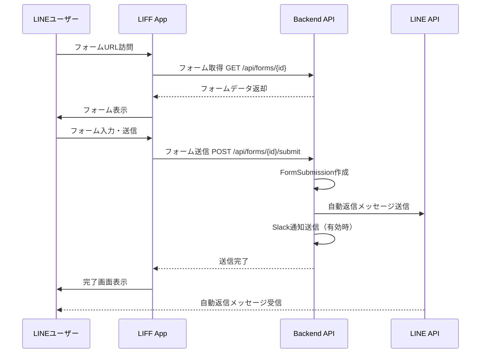

# LINEメッセージ送信システム 包括仕様書

## 📋 目次
1. [システム概要](#システム概要)
2. [機能要件](#機能要件)
3. [データベース設計](#データベース設計)
4. [メッセージテンプレート仕様](#メッセージテンプレート仕様)
5. [送信タイミングと条件](#送信タイミングと条件)
6. [LIFF独立フォーム送信](#liff独立フォーム送信)
7. [Slack通知連携](#slack通知連携)
8. [API設計](#api設計)
9. [実装フロー](#実装フロー)
10. [今後の拡張：シナリオ機能](#今後の拡張シナリオ機能)

---

## システム概要

### 目的
カレンダー予約システムにおいて、LINE公式アカウントを通じて柔軟で多様なメッセージ配信を実現する。
テキストと画像を組み合わせた最大5件のメッセージを、各コンテキスト（カレンダー、流入経路、ヒアリングフォーム）ごとにカスタマイズして自動送信できる。

### 主要機能
- ✅ **マルチメディアメッセージ送信**: テキスト + 画像（最大5件）
- ✅ **独立ヒアリングフォームLIFF**: 予約と切り離したフォーム送信
- ✅ **コンテキスト別自動返信**: カレンダー、流入経路、フォームごと
- ✅ **Slack通知統合**: 予約・フォーム送信時の通知
- ✅ **プレースホルダー機能**: 動的なメッセージ生成
- ✅ **将来対応**: シナリオベースの段階的配信

---

## 機能要件

### 1. メッセージテンプレート機能

#### 1.1 テンプレートの種類
- **予約完了メッセージ** (Calendar)
- **流入時ウェルカムメッセージ** (InflowSource)
- **フォーム送信完了メッセージ** (HearingForm独立送信)
- **予約確定メッセージ** (Calendar)
- **リマインドメッセージ** (Calendar)
- **キャンセル通知メッセージ** (Calendar)

#### 1.2 メッセージコンポーネント
各メッセージは以下の組み合わせで構成：
- **テキストメッセージ**: 最大5,000文字
- **画像メッセージ**: 最大1,024×1,024px、JPEG/PNG
- **順序**: 1〜5の順番で送信
- **混在可能**: テキスト→画像→テキスト等、自由な組み合わせ

### 2. 送信コンテキスト

#### 2.1 カレンダーベース自動返信
```
トリガー: 予約完了時
対象: 予約を行ったLINEユーザー
設定場所: calendars.line_auto_reply = true
```

#### 2.2 流入経路ベース自動返信
```
トリガー: LIFF初回アクセス時 / 友達追加時
対象: 特定流入経路からのユーザー
設定場所: inflow_sources.enable_welcome_message = true
```

#### 2.3 ヒアリングフォーム送信完了返信
```
トリガー: フォーム送信完了時（予約なし）
対象: フォームを送信したLINEユーザー
設定場所: hearing_forms.enable_auto_reply = true
```

### 3. プレースホルダー機能

#### 利用可能なプレースホルダー
```
{customer_name}         - お客様名
{customer_email}        - メールアドレス
{customer_phone}        - 電話番号
{reservation_date}      - 予約日（例: 2025年10月30日）
{reservation_time}      - 予約時刻（例: 14:00）
{reservation_datetime}  - 予約日時（例: 2025年10月30日 14:00）
{duration}              - 所要時間（分）
{meet_url}              - Google Meet URL
{calendar_name}         - カレンダー名
{inflow_source_name}    - 流入経路名
{form_name}             - フォーム名
{company_name}          - テナント名
{today_date}            - 今日の日付
```

---

## データベース設計

### 3.1 新規テーブル: `message_templates`

#### 目的
各コンテキスト（カレンダー、流入経路、フォーム）で使用するメッセージテンプレートを管理

```sql
CREATE TABLE message_templates (
    id BIGINT UNSIGNED AUTO_INCREMENT PRIMARY KEY,
    
    -- ポリモーフィック関連
    templatable_type VARCHAR(255) NOT NULL,  -- App\Models\Calendar, App\Models\InflowSource, App\Models\HearingForm
    templatable_id BIGINT UNSIGNED NOT NULL,
    
    -- メッセージタイプ
    message_type ENUM(
        'reservation_created',    -- 予約完了
        'reservation_confirmed',  -- 予約確定
        'reservation_cancelled',  -- 予約キャンセル
        'reminder',               -- リマインド
        'welcome',                -- ウェルカム
        'form_submitted'          -- フォーム送信完了
    ) NOT NULL,
    
    -- テンプレート名
    name VARCHAR(255) NOT NULL,
    description TEXT,
    
    -- 有効/無効
    is_active BOOLEAN DEFAULT TRUE,
    
    -- タイムスタンプ
    created_at TIMESTAMP NULL,
    updated_at TIMESTAMP NULL,
    
    INDEX idx_templatable (templatable_type, templatable_id),
    INDEX idx_message_type (message_type),
    INDEX idx_active (is_active)
);
```

### 3.2 新規テーブル: `message_template_items`

#### 目的
テンプレート内の各メッセージ要素（テキスト or 画像）を管理

```sql
CREATE TABLE message_template_items (
    id BIGINT UNSIGNED AUTO_INCREMENT PRIMARY KEY,
    
    -- 所属テンプレート
    message_template_id BIGINT UNSIGNED NOT NULL,
    
    -- 順序（1〜5）
    order INT NOT NULL DEFAULT 1,
    
    -- メッセージタイプ
    type ENUM('text', 'image') NOT NULL,
    
    -- コンテンツ
    content TEXT NULL,          -- テキストの場合
    image_url TEXT NULL,        -- 画像の場合
    image_preview_url TEXT NULL, -- 画像プレビューURL
    
    -- 画像アップロード情報
    original_filename VARCHAR(255) NULL,
    file_size INT NULL,
    mime_type VARCHAR(100) NULL,
    
    -- タイムスタンプ
    created_at TIMESTAMP NULL,
    updated_at TIMESTAMP NULL,
    
    FOREIGN KEY (message_template_id) REFERENCES message_templates(id) ON DELETE CASCADE,
    INDEX idx_template_order (message_template_id, order),
    CHECK (order >= 1 AND order <= 5)
);
```

### 3.3 既存テーブル更新: `hearing_forms`

```sql
ALTER TABLE hearing_forms 
ADD COLUMN enable_auto_reply BOOLEAN DEFAULT FALSE AFTER is_active,
ADD COLUMN slack_notify BOOLEAN DEFAULT FALSE AFTER enable_auto_reply,
ADD COLUMN slack_webhook TEXT NULL AFTER slack_notify,
ADD COLUMN slack_message TEXT NULL AFTER slack_webhook,
ADD COLUMN enable_standalone BOOLEAN DEFAULT FALSE COMMENT '独立LIFF送信を有効化' AFTER slack_message,
ADD COLUMN standalone_liff_url TEXT NULL COMMENT '独立LIFF URL' AFTER enable_standalone;
```

### 3.4 既存テーブル更新: `inflow_sources`

```sql
-- welcome_message と enable_welcome_message は既存
-- message_templates に移行するため、将来的に削除予定（後方互換性維持）
```

### 3.5 新規テーブル: `form_submissions`

#### 目的
予約と紐づかない独立したフォーム送信を記録

```sql
CREATE TABLE form_submissions (
    id BIGINT UNSIGNED AUTO_INCREMENT PRIMARY KEY,
    
    -- フォーム情報
    hearing_form_id BIGINT UNSIGNED NOT NULL,
    
    -- 送信者情報
    line_user_id BIGINT UNSIGNED NULL,
    inflow_source_id BIGINT UNSIGNED NULL,
    
    -- 送信者基本情報
    customer_name VARCHAR(255) NULL,
    customer_email VARCHAR(255) NULL,
    customer_phone VARCHAR(20) NULL,
    
    -- IPアドレスとユーザーエージェント
    ip_address VARCHAR(45) NULL,
    user_agent TEXT NULL,
    
    -- Slack通知状態
    slack_notified_at TIMESTAMP NULL,
    
    -- タイムスタンプ
    submitted_at TIMESTAMP DEFAULT CURRENT_TIMESTAMP,
    created_at TIMESTAMP NULL,
    updated_at TIMESTAMP NULL,
    
    FOREIGN KEY (hearing_form_id) REFERENCES hearing_forms(id) ON DELETE CASCADE,
    FOREIGN KEY (line_user_id) REFERENCES line_users(id) ON DELETE SET NULL,
    FOREIGN KEY (inflow_source_id) REFERENCES inflow_sources(id) ON DELETE SET NULL,
    
    INDEX idx_form (hearing_form_id),
    INDEX idx_line_user (line_user_id),
    INDEX idx_submitted_at (submitted_at)
);
```

### 3.6 新規テーブル: `form_submission_answers`

#### 目的
独立フォーム送信の回答を記録

```sql
CREATE TABLE form_submission_answers (
    id BIGINT UNSIGNED AUTO_INCREMENT PRIMARY KEY,
    
    form_submission_id BIGINT UNSIGNED NOT NULL,
    hearing_form_item_id BIGINT UNSIGNED NOT NULL,
    
    answer_text TEXT NULL,
    
    created_at TIMESTAMP NULL,
    updated_at TIMESTAMP NULL,
    
    FOREIGN KEY (form_submission_id) REFERENCES form_submissions(id) ON DELETE CASCADE,
    FOREIGN KEY (hearing_form_item_id) REFERENCES hearing_form_items(id) ON DELETE CASCADE,
    
    INDEX idx_submission (form_submission_id),
    INDEX idx_item (hearing_form_item_id)
);
```

---

## メッセージテンプレート仕様

### 4.1 LINE Messaging API メッセージフォーマット

#### テキストメッセージ
```json
{
    "type": "text",
    "text": "こんにちは、{customer_name}様\n\nご予約ありがとうございます。"
}
```

#### 画像メッセージ
```json
{
    "type": "image",
    "originalContentUrl": "https://example.com/image.jpg",
    "previewImageUrl": "https://example.com/preview.jpg"
}
```

#### 複数メッセージ送信例
```json
{
    "to": "U1234567890abcdef",
    "messages": [
        {
            "type": "text",
            "text": "ご予約ありがとうございます！"
        },
        {
            "type": "image",
            "originalContentUrl": "https://example.com/map.jpg",
            "previewImageUrl": "https://example.com/map_preview.jpg"
        },
        {
            "type": "text",
            "text": "予約日時: 2025年10月30日 14:00\n会場へのアクセスは上記地図をご確認ください。"
        }
    ]
}
```

### 4.2 画像アップロード仕様

#### ストレージ
- **保存先**: `storage/app/public/line_images/{tenant_id}/`
- **公開URL**: `https://yourdomain.com/storage/line_images/{tenant_id}/{filename}`
- **ファイル形式**: JPEG, PNG
- **最大サイズ**: 10MB
- **推奨サイズ**: 1024×1024px（正方形）
- **命名規則**: `{timestamp}_{random_string}.{ext}`

#### 画像処理
- アップロード時に自動リサイズ（最大1024px）
- プレビュー画像自動生成（240×240px）
- WebP形式への変換オプション（将来対応）

---

## 送信タイミングと条件

### 5.1 送信フロー一覧

| トリガー | コンテキスト | 送信条件 | テンプレートタイプ |
|---------|------------|---------|-----------------|
| LIFF初回アクセス | InflowSource | `enable_welcome_message = true` | `welcome` |
| 予約完了 | Calendar | `line_auto_reply = true` | `reservation_created` |
| 予約確定 | Calendar | 管理者が確定操作 | `reservation_confirmed` |
| リマインド | Calendar | `line_remind = true` | `reminder` |
| 予約キャンセル | Calendar | キャンセル操作 | `reservation_cancelled` |
| フォーム送信完了 | HearingForm | `enable_auto_reply = true` | `form_submitted` |

### 5.2 送信優先順位

#### 予約フロー
1. **流入時**: ウェルカムメッセージ（InflowSource）
2. **予約完了**: 予約完了メッセージ（Calendar）
3. **予約確定**: 確定メッセージ（Calendar）
4. **リマインド**: リマインドメッセージ（Calendar）

#### 独立フォームフロー
1. **流入時**: ウェルカムメッセージ（InflowSource） ※任意
2. **フォーム送信完了**: 完了メッセージ（HearingForm）

---

## LIFF独立フォーム送信

### 6.1 概要
予約プロセスと切り離して、ヒアリングフォームのみを送信できる機能。
アンケート収集、問い合わせフォーム、イベント参加申込などに利用。

### 6.2 URL構造
```
https://liff.line.me/{liff_id}/form/{form_id}?source={source_key}
```

### 6.3 フロー


### 6.4 API エンドポイント

#### フォーム取得
```http
GET /api/tenant/forms/{form_id}
```

**レスポンス例**:
```json
{
    "id": 1,
    "name": "お問い合わせフォーム",
    "description": "お気軽にお問い合わせください",
    "is_active": true,
    "enable_standalone": true,
    "items": [
        {
            "id": 1,
            "label": "お名前",
            "type": "text",
            "required": true,
            "order": 1
        },
        {
            "id": 2,
            "label": "メールアドレス",
            "type": "email",
            "required": true,
            "order": 2
        }
    ]
}
```

#### フォーム送信
```http
POST /api/tenant/forms/{form_id}/submit
Content-Type: application/json

{
    "line_user_id": "U1234567890abcdef",
    "inflow_source_id": 5,
    "customer_name": "山田太郎",
    "customer_email": "yamada@example.com",
    "customer_phone": "090-1234-5678",
    "answers": [
        {
            "hearing_form_item_id": 1,
            "answer_text": "山田太郎"
        },
        {
            "hearing_form_item_id": 2,
            "answer_text": "yamada@example.com"
        }
    ]
}
```

**レスポンス例**:
```json
{
    "success": true,
    "message": "フォームを送信しました",
    "submission_id": 123,
    "auto_reply_sent": true,
    "slack_notified": true
}
```

---

## Slack通知連携

### 7.1 通知対象

#### Calendar（既存）
- 予約作成時
- 予約確定時
- 予約キャンセル時

#### HearingForm（新規）
- 独立フォーム送信時

### 7.2 通知フォーマット

#### 予約通知（Calendar）
```json
{
    "text": "📅 新しい予約が入りました",
    "blocks": [
        {
            "type": "header",
            "text": {
                "type": "plain_text",
                "text": "📅 新しい予約"
            }
        },
        {
            "type": "section",
            "fields": [
                {
                    "type": "mrkdwn",
                    "text": "*カレンダー:*\n初回相談"
                },
                {
                    "type": "mrkdwn",
                    "text": "*お客様:*\n山田太郎"
                },
                {
                    "type": "mrkdwn",
                    "text": "*予約日時:*\n2025年10月30日 14:00"
                },
                {
                    "type": "mrkdwn",
                    "text": "*流入経路:*\nInstagram広告"
                }
            ]
        },
        {
            "type": "section",
            "text": {
                "type": "mrkdwn",
                "text": "<https://yourdomain.com/reservations/123|詳細を見る>"
            }
        }
    ]
}
```

#### フォーム送信通知（HearingForm）
```json
{
    "text": "📝 フォームが送信されました",
    "blocks": [
        {
            "type": "header",
            "text": {
                "type": "plain_text",
                "text": "📝 フォーム送信"
            }
        },
        {
            "type": "section",
            "fields": [
                {
                    "type": "mrkdwn",
                    "text": "*フォーム:*\nお問い合わせフォーム"
                },
                {
                    "type": "mrkdwn",
                    "text": "*送信者:*\n山田太郎"
                },
                {
                    "type": "mrkdwn",
                    "text": "*メール:*\nyamada@example.com"
                },
                {
                    "type": "mrkdwn",
                    "text": "*電話:*\n090-1234-5678"
                }
            ]
        },
        {
            "type": "section",
            "text": {
                "type": "mrkdwn",
                "text": "*回答内容:*\n```お問い合わせ内容を教えてください\n→ 料金について詳しく知りたいです```"
            }
        },
        {
            "type": "section",
            "text": {
                "type": "mrkdwn",
                "text": "<https://yourdomain.com/forms/submissions/123|詳細を見る>"
            }
        }
    ]
}
```

### 7.3 Webhook URL設定

#### Calendar
- `calendars.slack_webhook`
- `calendars.slack_notify` = true で有効化

#### HearingForm
- `hearing_forms.slack_webhook`
- `hearing_forms.slack_notify` = true で有効化

---

## API設計

### 8.1 メッセージテンプレート管理 API

#### テンプレート一覧取得
```http
GET /api/tenant/message-templates?templatable_type=App\Models\Calendar&templatable_id=1
```

#### テンプレート作成
```http
POST /api/tenant/message-templates
Content-Type: application/json

{
    "templatable_type": "App\\Models\\Calendar",
    "templatable_id": 1,
    "message_type": "reservation_created",
    "name": "予約完了メッセージ",
    "description": "予約が完了した際に送信されるメッセージ",
    "is_active": true,
    "items": [
        {
            "order": 1,
            "type": "text",
            "content": "こんにちは、{customer_name}様\n\nご予約ありがとうございます！"
        },
        {
            "order": 2,
            "type": "image",
            "image_url": "https://example.com/image.jpg",
            "image_preview_url": "https://example.com/preview.jpg"
        },
        {
            "order": 3,
            "type": "text",
            "content": "予約日時: {reservation_datetime}\n所要時間: {duration}分"
        }
    ]
}
```

#### テンプレート更新
```http
PUT /api/tenant/message-templates/{id}
```

#### テンプレート削除
```http
DELETE /api/tenant/message-templates/{id}
```

#### 画像アップロード
```http
POST /api/tenant/message-templates/upload-image
Content-Type: multipart/form-data

file: [binary]
```

**レスポンス例**:
```json
{
    "success": true,
    "image_url": "https://yourdomain.com/storage/line_images/tenant_1/1730281234_abc123.jpg",
    "preview_url": "https://yourdomain.com/storage/line_images/tenant_1/1730281234_abc123_preview.jpg",
    "filename": "1730281234_abc123.jpg",
    "size": 245678
}
```

### 8.2 フォーム管理 API

#### フォーム設定更新
```http
PUT /api/tenant/hearing-forms/{id}/settings
Content-Type: application/json

{
    "enable_standalone": true,
    "enable_auto_reply": true,
    "slack_notify": true,
    "slack_webhook": "https://hooks.slack.com/services/XXX/YYY/ZZZ",
    "slack_message": "新しいフォーム送信がありました"
}
```

#### フォーム送信履歴取得
```http
GET /api/tenant/form-submissions?hearing_form_id=1&page=1&per_page=20
```

**レスポンス例**:
```json
{
    "data": [
        {
            "id": 123,
            "hearing_form_id": 1,
            "customer_name": "山田太郎",
            "customer_email": "yamada@example.com",
            "customer_phone": "090-1234-5678",
            "submitted_at": "2025-10-30T14:30:00Z",
            "slack_notified_at": "2025-10-30T14:30:05Z",
            "answers": [
                {
                    "item_label": "お問い合わせ内容",
                    "answer_text": "料金について詳しく知りたいです"
                }
            ]
        }
    ],
    "meta": {
        "current_page": 1,
        "per_page": 20,
        "total": 150
    }
}
```

### 8.3 流入経路管理 API

#### ウェルカムメッセージ設定
```http
PUT /api/tenant/inflow-sources/{id}/welcome-message
Content-Type: application/json

{
    "enable_welcome_message": true,
    "template_id": 5  // message_templatesのID
}
```

---

## 実装フロー

### 9.1 実装順序

#### Phase 1: データベース構築（Week 1）
1. マイグレーションファイル作成
   - `message_templates`
   - `message_template_items`
   - `form_submissions`
   - `form_submission_answers`
   - `hearing_forms` 更新

2. モデル作成
   - `MessageTemplate`
   - `MessageTemplateItem`
   - `FormSubmission`
   - `FormSubmissionAnswer`

3. リレーション定義

#### Phase 2: メッセージテンプレート機能（Week 2-3）
1. テンプレート管理 API 実装
2. 画像アップロード機能実装
3. プレースホルダー置換ロジック実装
4. LINE送信サービス拡張
5. 管理画面UI実装（React）

#### Phase 3: 独立フォーム送信（Week 4）
1. フォーム送信API実装
2. FormSubmissionロジック実装
3. LIFF独立フォームページ作成
4. 自動返信ロジック統合

#### Phase 4: Slack通知拡張（Week 5）
1. HearingForm Slack通知実装
2. 通知フォーマット改善
3. エラーハンドリング強化

#### Phase 5: 既存機能の移行（Week 6）
1. 既存の単一メッセージをテンプレートに移行
2. 後方互換性維持
3. データマイグレーションスクリプト

#### Phase 6: テスト・調整（Week 7-8）
1. 単体テスト作成
2. 統合テスト実施
3. 本番環境デプロイ

### 9.2 主要クラス設計

#### MessageTemplate モデル
```php
class MessageTemplate extends Model
{
    protected $fillable = [
        'templatable_type',
        'templatable_id',
        'message_type',
        'name',
        'description',
        'is_active',
    ];

    public function templatable(): MorphTo
    public function items(): HasMany
    public function buildMessages(array $data): array
}
```

#### LineMessagingService 拡張
```php
class LineMessagingService
{
    public function sendTemplate(string $userId, MessageTemplate $template, array $data): bool
    public function sendMultipleMessages(string $userId, array $messages): bool
    private function replacePlaceholders(string $text, array $data): string
    private function buildLineMessages(MessageTemplate $template, array $data): array
}
```

#### FormSubmissionService
```php
class FormSubmissionService
{
    public function submit(HearingForm $form, array $data): FormSubmission
    private function sendAutoReply(FormSubmission $submission): void
    private function sendSlackNotification(FormSubmission $submission): void
}
```

---

## 今後の拡張：シナリオ機能

### 10.1 シナリオ機能概要
時系列に沿って段階的にメッセージを配信する機能。

#### ユースケース
- **育成シナリオ**: 初回接触 → 3日後 → 1週間後 → 2週間後
- **フォローアップ**: 予約後 → 前日 → 当日 → アフターフォロー
- **教育コンテンツ**: Day 1 → Day 2 → Day 3...

### 10.2 想定データ構造

#### scenarios テーブル
```sql
CREATE TABLE scenarios (
    id BIGINT UNSIGNED AUTO_INCREMENT PRIMARY KEY,
    name VARCHAR(255) NOT NULL,
    description TEXT,
    trigger_type ENUM('manual', 'reservation_created', 'form_submitted', 'tag_added') NOT NULL,
    is_active BOOLEAN DEFAULT TRUE,
    created_at TIMESTAMP NULL,
    updated_at TIMESTAMP NULL
);
```

#### scenario_steps テーブル
```sql
CREATE TABLE scenario_steps (
    id BIGINT UNSIGNED AUTO_INCREMENT PRIMARY KEY,
    scenario_id BIGINT UNSIGNED NOT NULL,
    step_number INT NOT NULL,
    delay_value INT NOT NULL COMMENT '遅延値',
    delay_unit ENUM('minutes', 'hours', 'days') NOT NULL,
    message_template_id BIGINT UNSIGNED NOT NULL,
    condition_type ENUM('none', 'tag', 'status') NULL,
    condition_value TEXT NULL,
    created_at TIMESTAMP NULL,
    updated_at TIMESTAMP NULL,
    
    FOREIGN KEY (scenario_id) REFERENCES scenarios(id) ON DELETE CASCADE,
    FOREIGN KEY (message_template_id) REFERENCES message_templates(id) ON DELETE CASCADE
);
```

#### scenario_executions テーブル
```sql
CREATE TABLE scenario_executions (
    id BIGINT UNSIGNED AUTO_INCREMENT PRIMARY KEY,
    scenario_id BIGINT UNSIGNED NOT NULL,
    line_user_id BIGINT UNSIGNED NOT NULL,
    current_step INT DEFAULT 1,
    status ENUM('active', 'paused', 'completed', 'cancelled') DEFAULT 'active',
    started_at TIMESTAMP NULL,
    completed_at TIMESTAMP NULL,
    created_at TIMESTAMP NULL,
    updated_at TIMESTAMP NULL,
    
    FOREIGN KEY (scenario_id) REFERENCES scenarios(id) ON DELETE CASCADE,
    FOREIGN KEY (line_user_id) REFERENCES line_users(id) ON DELETE CASCADE
);
```

### 10.3 シナリオ実装時の考慮事項
- Queueジョブによる遅延実行
- 条件分岐のサポート
- ABテスト機能
- 配信停止・再開機能
- 効果測定（開封率・クリック率）

---

## まとめ

### 主要機能
1. ✅ **柔軟なメッセージ配信**: テキスト + 画像最大5件
2. ✅ **コンテキスト別自動返信**: Calendar / InflowSource / HearingForm
3. ✅ **独立フォーム送信**: 予約と切り離したアンケート・問い合わせ
4. ✅ **Slack統合**: リアルタイム通知
5. ✅ **プレースホルダー**: 動的メッセージ生成
6. ✅ **拡張性**: 将来のシナリオ機能に対応

### 技術スタック
- **Backend**: Laravel 11, PHP 8.2+
- **Frontend**: React 18, TypeScript
- **Database**: MySQL 8.0+
- **Queue**: Redis + Laravel Queue
- **Storage**: Laravel Storage (S3対応可)
- **LINE**: Messaging API v2

### 開発期間
**約8週間（2ヶ月）**を想定

---

**作成日**: 2025年10月30日  
**バージョン**: 1.0  
**作成者**: Cal-Connect Development Team

